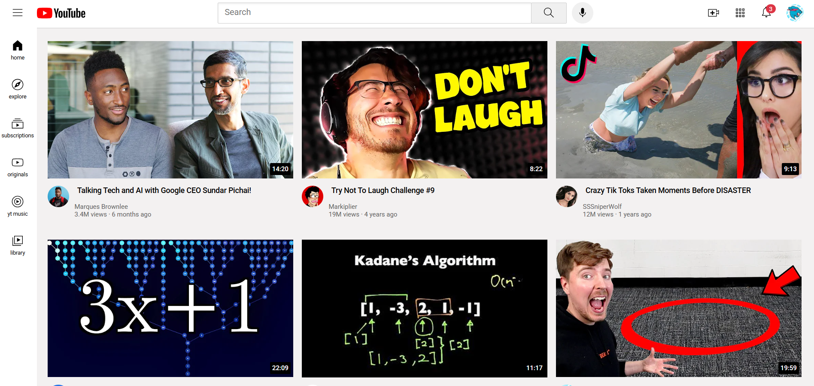

# 📺 YouTube Clone

A simple and responsive clone of the YouTube homepage built using HTML, CSS, and JavaScript. This project replicates the core layout and design of YouTube to help understand web layout structures, responsiveness, and basic DOM interactions.

## 🌐 Live Demo

[🔗 View Project]( https://veeru-10.github.io/youtube-clone/)

## 📁 Technologies Used

- **HTML5** – Page structure
- **CSS3** – Styling and responsiveness
- **JavaScript** – For basic interactivity (if implemented)

## 🧱 Project Structure
youtube-clone/
│
├── index.html # Main page layout
├── style.css # Styling for YouTube layout
├── script.js # Optional JS for menu toggle/search (if used)
└── assets

## 📸 Preview

📄 License
> This project is open-source and available under the MIT License.

👩‍💻 Author
> Veeranjini Vemala
> GitHub: @veeru-10
> Email: veeranjinivemala@gmail.com